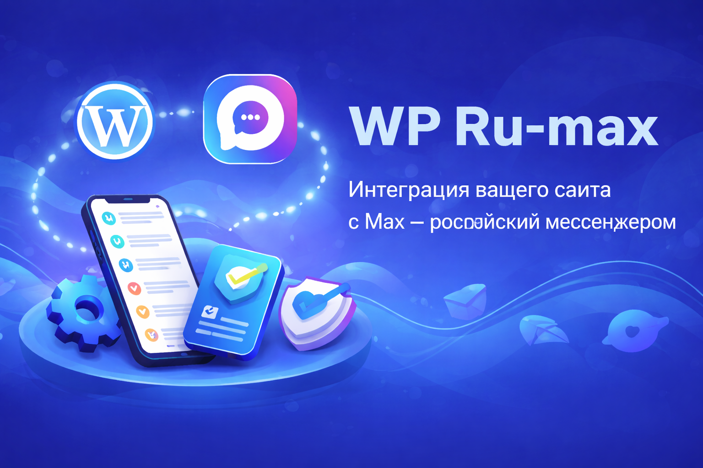
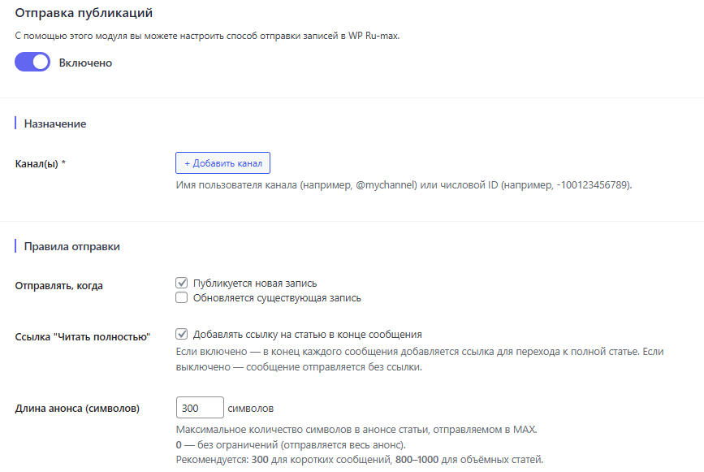
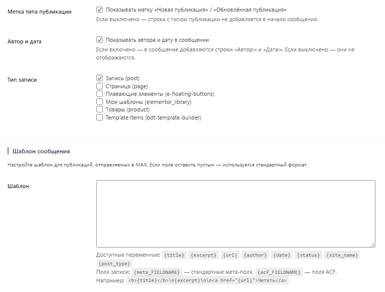
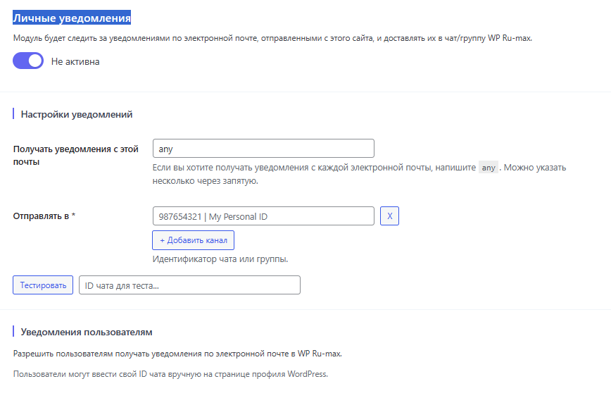
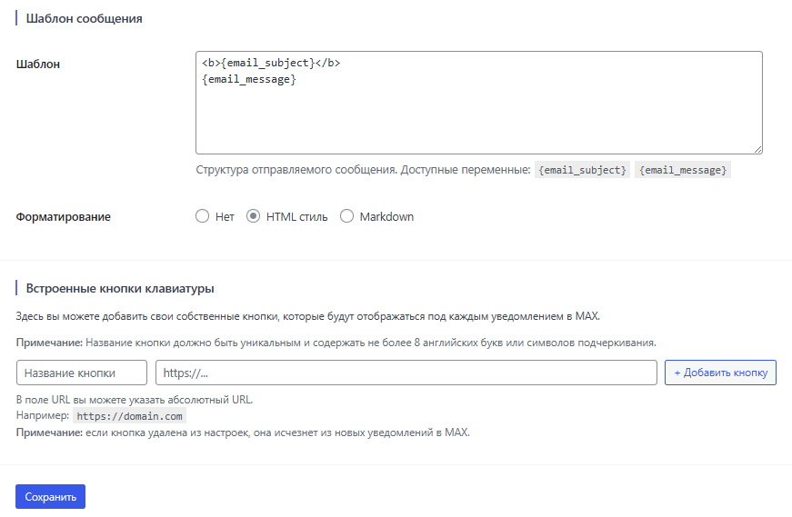
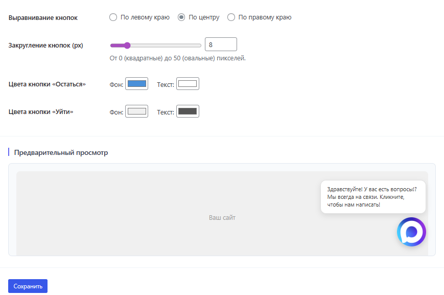
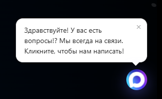

# Интеграция WordPress с мессенджером MAX

<p align="center">
  
</p>

<div align="center">
## Интеграция WordPress с мессенджером MAX
  
**WP Ru-max** Плагин для WordPress, который подключает ваш сайт к российскому мессенджеру **MAX (max.ru)**. Автоматическая публикация записей, личные уведомления с любых форм и красивый чат-виджет.


**Интеграция WordPress с мессенджером MAX**

[Получить лицензию](https://рукодер.рф) · [Документация](#установка) · [Поддержка](#поддержка) · [Changelog](#changelog)

<a href="https://rucoder-sudo.github.io/wp-ru-max/">
  
</a>
</div>

## О плагине

### Основные возможности

#### Автопубликация
- Новая или обновлённая запись / страница → автоматически отправляется в **канал MAX**.
- Поддержка миниатюры (изображение прикрепляется к сообщению).
- Возможность отключить ссылку «Читать полностью».

#### Личные уведомления
- Перехват всех email-уведомлений WordPress.
- Поддержка **WooCommerce** (новые заказы), **Contact Form 7**, **Elementor Forms**, **Gravity Forms**, **Ninja Forms** и любых других форм, использующих `wp_mail()`.
- Каждое письмо дублируется в личный чат с ботом MAX.

#### Чат-виджет
- Плавающая кнопка MAX на сайте.
- Анимация «печатания» для приветственного сообщения.
- Полная кастомизация внешнего вида (через настройки плагина).

#### История и логи
- Полная таблица всех событий (отправки, ошибки, тесты).
- Фильтрация по типу, дате, статусу.
- Просмотр подробного JSON-лога каждого запроса.
<p align="center">
  
  
  
  
  
  
</p>

#### Тестирование
- Встроенная проверка подключения к боту MAX.
- Отправка тестового сообщения в выбранный канал / чат.

---

### Совместимость

| Компонент            |  Поддержка  |
|----------------------| ----------- |
| WordPress            |  5.8 – 6.7  |
| PHP                  |  7.4+       |
| WooCommerce          | ✔️(заказы) |
| Contact Form 7       | ✔️         |
| Elementor Forms      | ✔️         |
| Gravity Forms        | ✔️         |
| Ninja Forms          | ✔️         |
| Любые формы через `wp_mail` |  ✔️  |

**WP Ru-max** подключает WordPress-сайт к мессенджеру [MAX (max.ru)](https://max.ru) и решает три задачи:

- **Автопубликация** — новые записи и страницы автоматически отправляются в канал MAX.
- **Уведомления** — все email WordPress (заказы WooCommerce, заявки с форм) дублируются в личный чат с ботом.
- **Чат-виджет** — настраиваемая плавающая кнопка MAX на сайте для связи с посетителями.

Лицензирование и управление ключами реализовано через REST API сайта [рукодер.рф](https://рукодер.рф).
📲 Telegram: @RussCoder
🌐 https://рукодер.рф

---

## Возможности

### Автопубликация записей

| Функция | Описание |
|---|---|
| Отправка при публикации | Новая или обновлённая запись / страница → сообщение в канал MAX |
| Миниатюра | Изображение прикрепляется к сообщению |
| Ссылка «Читать полностью» | Опционально — можно отключить |
| Ручная отправка | Кнопка «Отправить в MAX» прямо в редакторе записи |
| Типы записей | Любые публичные типы (posts, pages, CPT) |

### Уведомления в личный чат

| Функция | Описание |
|---|---|
| Перехват `wp_mail()` | Все email-уведомления WordPress → в MAX |
| WooCommerce | Новый заказ, смена статуса, оплата и т.д. |
| Contact Form 7 | Уведомления со всех форм |
| Elementor Forms | Включая Elementor Pro |
| Gravity Forms | Полная поддержка |
| Ninja Forms | Полная поддержка |

### Чат-виджет

| Функция | Описание |
|---|---|
| Плавающая кнопка | Иконка MAX в углу сайта |
| Приветственное сообщение | Текст с анимацией «печатания» |
| Анимации внимания | Пульс, рябь, подпрыгивание, встряска |
| Звуковое уведомление | 3 варианта (синтез через Web Audio API, без аудиофайлов) |
| Задержка появления | 0 / 5 / 8 / 10 / 15 секунд |
| Задержка звука | 3 / 6 / 9 секунд после появления |
| Отступ от края | Слайдер 0–200 px |
| Кнопка закрытия | Крестик на приветственном баллоне |

### Логи и тестирование

| Функция | Описание |
|---|---|
| Таблица событий | Все отправки, ошибки, тесты |
| Фильтрация | По типу, дате, статусу |
| JSON-лог | Полный запрос и ответ API для каждого события |
| Проверка подключения | Тест соединения с ботом MAX |
| Тестовое сообщение | Отправка в любой канал / чат |

---

## Требования

- WordPress 5.8 или выше
- PHP 7.4 или выше (протестировано на PHP 8.0–8.3)
- Действующий токен бота MAX

---

## Установка

### Способ 1: через панель WordPress

1. Скачайте ZIP-архив плагина
2. Перейдите в **Плагины → Добавить новый → Загрузить плагин**
3. Выберите файл `wp-ru-max.zip` и нажмите **Установить**
4. Нажмите **Активировать плагин**

### Способ 2: через FTP / SSH

1. Клонируйте репозиторий или распакуйте архив:
   ```bash
   git clone https://github.com/RuCoder-sudo/wp-ru-max.git
   ```
2. Загрузите папку `wp-ru-max` в `/wp-content/plugins/`
3. Активируйте плагин в **Плагины → Установленные плагины**

---

## Настройка

### 1. Активация лицензии

1. Перейдите в **Ru-max → Активация**
2. Введите лицензионный ключ (формат `WPRM-XXXX-XXXX-XXXX-XXXX`)
3. Нажмите **Активировать**

Нет ключа — заполните форму «Запросить лицензионный ключ» на той же вкладке.

### 2. Подключение бота MAX

1. Получите токен бота на платформе [MAX для партнёров](https://max.ru/partner):  
   «Чат-боты» → «Интеграция» → «Получить токен»
2. Вставьте токен на вкладке **Ru-max → Главная**
3. Нажмите **Проверить подключение**

### 3. Автопубликация

На вкладке **Публикация**:
- Включите автоотправку и укажите ID или никнейм канала MAX
- Настройте формат сообщения и включение/отключение ссылки

### 4. Уведомления

На вкладке **Уведомления**:
- Включите перехват `wp_mail()`
- Опционально — укажите фильтр тем для выбора нужных уведомлений

### 5. Чат-виджет

На вкладке **Виджет**:
- Включите виджет и укажите ссылку на бота или канал
- Настройте текст приветствия, анимацию, звук, задержку и отступ

---


## Как работает автообновление

Плагин проверяет [GitHub Releases](https://github.com/RuCoder-sudo/wp-ru-max/releases) раз в 12 часов. Если тег нового релиза новее установленной версии — в WordPress появляется стандартное уведомление «Доступно обновление». Обновление устанавливается в один клик, как обычный плагин из WordPress.org.

---

## Changelog

### 1.0.21
- **Лицензирование:** фоновая перепроверка ключа сокращена с 1 раза в сутки до 1 раза в час (`RECHECK_SECONDS = 3600`)
- При открытии вкладки «Активация» плагин делает принудительную сверку ключа с сервером рукодер.рф — отозванные ключи определяются мгновенно
- Добавлен метод `WP_Ru_Max_License::force_recheck()` и AJAX-обработчик `wp_ru_max_recheck_license`
- Кнопка **«Проверить лицензию сейчас»** на вкладке «Активация» при активной лицензии + отображение даты последней проверки
- Если сервер сообщил, что ключ отозван — статус сразу переключается на `suspended`, в логе пишется запись «Лицензия отозвана сервером», а на вкладке «Активация» появляется красная плашка с указанием отозванного ключа
- На вкладке «Активация» добавлен блок **«Важная информация о лицензии»** (стоимость 2 200 ₽, бессрочная лицензия, список преимуществ)
- Блок **«Система скидок на лицензии»** (1/2/5 доменов) перенесён со вкладки «Инструкция» на вкладку «Активация»
- В форму «Запросить лицензионный ключ» добавлено поле **«Контакт для быстрой связи»** (Telegram / MAX / WhatsApp / VK), которое передаётся в email-уведомление владельцу

### 1.0.20
- Расширенные настройки попапа удержания: многострочные заголовок и сообщение, выравнивание текста и кнопок (лево/центр/право)
- Индивидуальные тексты, цвета фона/текста и закругление углов кнопок «Остаться» и «Уйти»

### 1.0.19
- Добавлена функция «Сообщения на удержание» — попап с настраиваемым заголовком и сообщением при попытке закрыть приветствие чат-виджета
- Тумблер включения, поля заголовка и сообщения, кнопки «Остаться» и «Все равно уйти»
- Исправлен предварительный просмотр анимации привлечения внимания в админке
- На вкладке «Инструкция» добавлен блок со скидками на лицензии (1/2/5 доменов)

### 1.0.18
- Исправлено ложное уведомление «доступна свежая версия 1.017» (нормализация версий)
- Сброс старого кэша проверки обновлений при первой загрузке
- Увеличена ширина рабочей панели настроек плагина

### 1.0.17
- Лицензирование полностью переведено на REST API сайта рукодер.рф (Key Manager)
- Устаревшие файлы локальной генерации ключей удалены

### 1.0.16
- Исправлена критическая ошибка: звук не воспроизводился, если пользователь взаимодействовал со страницей до истечения задержки появления виджета
- AudioContext теперь создаётся и разблокируется немедленно при первом взаимодействии

### 1.0.15
- Добавлен слайдер отступа виджета от края (0–200 px)
- Добавлены 3 варианта звука и 4 варианты анимации привлечения внимания
- Задержка появления виджета: 0 / 5 / 8 / 10 / 15 с
- Кнопка закрытия (×) на приветственном баллоне

---

## FAQ

**Где взять токен бота MAX?**  
[max.ru/partner](https://max.ru/partner) → «Чат-боты» → «Интеграция» → «Получить токен».

**Как узнать ID канала или группы?**  
Публичный канал — никнейм с `@` (например, `@my_channel`).  
Группа — числовой ID (получить через бота `@get_id_bot` в MAX).

**Работает ли плагин без лицензии?**  
Базовые функции доступны. Полный доступ требует лицензионного ключа.

**Почему звук не играет при загрузке страницы?**  
Браузеры блокируют автовоспроизведение звука до первого взаимодействия пользователя. Звук сыграет сразу после первого клика, касания или прокрутки.

**Работает ли обновление без WordPress.org?**  
Да. Плагин проверяет GitHub Releases и обновляется стандартными средствами WordPress.

---

## Поддержка

| Канал | Контакт |
|---|---|
| Telegram | [@RussCoder](https://t.me/RussCoder) |
| WhatsApp | +7 (985) 985-53-97 |
| Email | rucoder.rf@yandex.ru |
| Сайт | [рукодер.рф](https://рукодер.рф) |
| GitHub Сайт | [wp-ru-max](https://rucoder-sudo.github.io/wp-ru-max/) |
| GitHub Issues | [github.com/RuCoder-sudo/wp-ru-max/issues](https://github.com/RuCoder-sudo/wp-ru-max/issues) |

---

## Лицензия

Плагин распространяется под лицензией [GPL-2.0+](https://www.gnu.org/licenses/gpl-2.0.html).

---
<div align="center">  </div>


<div align="center">
Разработано с ❤️ — <a href="https://рукодер.рф">РуКодер</a> · Сергей Солошенко
</div>

